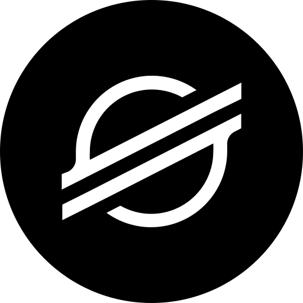
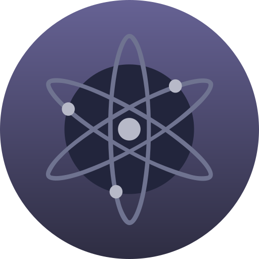
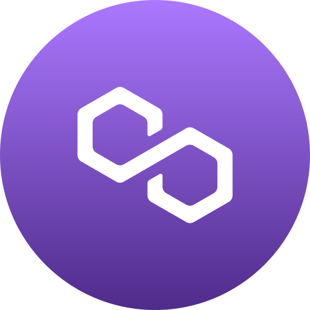

## 👻 A little about me...

I am a passionate **Full Stack and Blockchain Developer** with over 8+ years of experience in web development and 4+ years focused on blockchain technology. 


I specialize in developing **Frontend, Backend, SmartContract, DEXs,  DApps, Defi, Dao, NFT marketplaces, Wallets, Bridges, Gaming App, Telegram Mini App, Meme coin, Trading bot and Launchpads**. 


My core skills include **TypeScript, Rust, Solidity, Go, Python, Java, SQL and C++**, and I have extensive experience working across multiple blockchain ecosystems, including **Ethereum, Solana, Polkadot, Stellar, Cosmos, Binance, Polygon, Aptos, Sui, Ton, Tron and more**.

```javascript
const schullegerhard  = {
    programLanguage: {
        highLevel: ["Typescript", "Rust", "Solidity", "Go", "Python", "C++", "Java", "SQL"],
    },
    fullstack: {
        frontend: ["React.js", "Next.js", "Vue.js", "React Native", "Flutter", "Three.js"],
        backend: ["Node.js", "Nest.js", "Django", "FastAPI", "Flask"],
        databases: ["PostgreSQL", "MongoDB", "SQLite", "MySQL"]
    },
    blockchain: {
        experience: ["SmartContract", "DEX", "DApps", "Defi", "Dao", "NFT Marketplace", "Gaming", "Wallet", "Bridges", "Telegram Mini App", "Trading Bot", "Launchpads", "Meme coin"],
        ecosystem: ["Ethereum", "Solana", "Aptos", "Polkadot", "Cosmos", "Binance", "Polygon", "Ton", "Tron", "Stellar", "Sui"]
    }
};

```
##  🥇 Main Skill
<br />


<table align="center">
<!-- skill -->
  <tr>
    <td align="center" width="90">
      
      <br>Javascript
    </td>
    <td align="center" width="90">
      
      <br>Typescript
    </td>
    <td align="center" width="90">
      
      <br>Rust
    </td>
     <td align="center" width="90">
      
      <br>Solidity
    </td>
    <td align="center" width="90">
      
      <br>C++
    </td>
    <td align="center" width="90">
      
      <br>GoLang
    </td>
    <td align="center" width="90">
      
      <br>Python
    </td>
    <td align="center" width="90">
      
      <br>PHP
    </td>
    <td align="center" width="90">
      
      <br>Ruby
    </td>
    <td align="center" width="90">
      
      <br>java
    </td>
  </tr>
<!-- framework -->
<tr>
    <td align="center" width="90">
      
      <br>React
    </td>
    <td align="center" width="90">
      
      <br>Next.js
    </td>
    <td align="center" width="90">
      
      <br>Vue
    </td>
    <td align="center" width="90">
      
      <br>Nuxt.js
    </td>
    <td align="center" width="90">
      
      <br>Angular
    </td>
    <td align="center" width="90">
      
      <br>Express
    </td>
    <td align="center" width="90">
      
      <br>Laravel
    </td>
    <td align="center" width="90">
      
      <br>Nodejs
    </td>
    <td align="center" width="90">
      
      <br>Django
    </td>
    <td align="center" width="90">
      
      <br>Flask
    </td>
  </tr>
<!-- common -->
<!-- network -->
<tr>
  <td align="center" width="90">
      
      <br>Ethereum
    </td>
    <td align="center" width="90">
      
      <br>Solana
    </td>
    <td align="center" width="90">
      
      <br>Stellar
    </td>
    <td align="center" width="90">
      
      <br>Aptos
    </td>
    <td align="center" width="90">
      
      <br>Polkadot
    </td>
    <td align="center" width="90">
      
      <br>Cosmos
    </td>
    <td align="center" width="90">
      
      <br>Polygon
    </td>
    <td align="center" width="90">
      
      <br>Ton
    </td>
    <td align="center" width="90">
      
      <br>Tron
    </td>
    <td align="center" width="90">
      
      <br>Sui
    </td>

  </tr>
  <tr>
    <td align="center" width="90">
      
      <br>Binance
    </td>
    <td align="center" width="90">
      
      <br>Flutter
    </td>
    <td align="center" width="90">
      
      <br>Fastapi
    </td>
    <td align="center" width="90">
      
      <br>Tailwind
    </td>
    <td align="center" width="90">
      
      <br>MongoDB
    </td>
    <td align="center" width="90">
      
      <br>MySQL
    </td>
    <td align="center" width="90">
      
      <br>PostgreSQL
    </td>
    <td align="center" width="90">
      
      <br>SQLite
    </td>
    <td align="center" width="90">
      
      <br>Nestjs
    </td>
    <td align="center" width="90">
      
      <br>Svelte
    </td>
  </tr>
  
</table>
